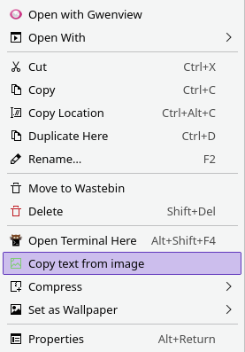
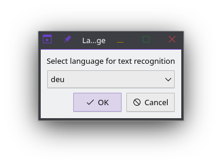
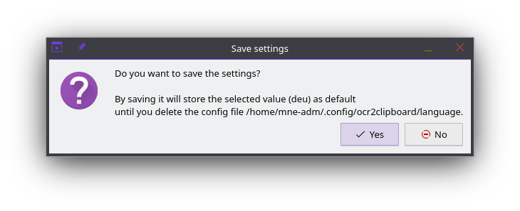

# OCR2Clipboard - KDE Dolphin Service Menu

A KDE Dolphin service menu that allows you to extract text from images using OCR (Optical Character Recognition) and copy it directly to your clipboard with a simple right-click.

## Features

- **Right-click integration**: Extract text from any image file directly from Dolphin file manager

- **Multi-language support**: Choose from all available Tesseract language packs

- **Language preference saving**: Optionally save your preferred language for future use

- **Clipboard integration**: Extracted text is automatically copied to your clipboard via KDE's Klipper
- **User-friendly notifications**: Get feedback about the OCR process through desktop notifications
- **Easy installation/uninstallation**: Simple setup script for quick deployment

## Dependencies

- **KDE Plasma Desktop Environment**
- **Tesseract OCR Engine**: The core OCR functionality
- **Tesseract Language Data**: At least one language pack
- **kdialog**: For the language selection interface (usually included with KDE)
- **klipper**: For clipboard management (usually included with KDE)

## Supported Image Formats

All image formats supported by Tesseract, including:
- PNG
- JPEG/JPG
- TIFF
- BMP
- GIF
- PDF (single page)

## Installation

### 1. Install Tesseract and Language Packs

**Arch Linux (based):**

```bash
# Install Tesseract with German language pack
yay -S tesseract tesseract-data-deu

# Or install multiple language packs
yay -S tesseract tesseract-data-eng tesseract-data-deu tesseract-data-fra
```

**Ubuntu / Debian:**

```bash
sudo apt install tesseract-ocr tesseract-ocr-deu tesseract-ocr-eng
```

**Fedora:**

```bash
sudo dnf install tesseract tesseract-langpack-deu tesseract-langpack-eng
```

### 2. Install the Service Menu

Clone the repository and run the installation script:

```bash
git clone https://github.com/madic-creates/kde-service-menu-ocr2clipboard.git
cd kde-service-menu-ocr2clipboard
./setup.sh -i
```

The installation script will:
- Copy `ocr2clipboard.sh` to `~/.local/bin/`
- Copy `ocr2clipboard.desktop` to `~/.local/share/kio/servicemenus/`
- Create necessary directories if they don't exist

## Usage

1. **Right-click on any image file** in Dolphin file manager
2. **Select "Copy text from image"** from the context menu
3. **Choose your preferred language** from the dialog that appears
4. **Optionally save the language setting** for future use
5. **Wait for the notification** confirming the text has been copied to clipboard
6. **Paste the extracted text** anywhere using `Ctrl+V`

## Configuration

### Language Preferences

The first time you use the service, you'll be asked to select a language and whether to save this preference. If you choose to save:

- Your language preference is stored in: `~/.config/ocr2clipboard/language`
- To change the saved language, simply delete the config file: `rm -rf ~/.config/ocr2clipboard`
- The next OCR operation will ask for language selection again

### Available Languages

To see all available languages on your system:
```bash
tesseract --list-langs
```

Common language codes:
- `eng` - English
- `deu` - German
- `fra` - French
- `spa` - Spanish
- `ita` - Italian
- `por` - Portuguese
- `rus` - Russian
- `chi_sim` - Chinese Simplified
- `jpn` - Japanese

## Troubleshooting

### "Can't find tesseract" Error

- Ensure Tesseract is installed: `tesseract --version`
- Check if Tesseract is in your PATH
- Reinstall Tesseract if necessary

### No Language Options Available

- Install additional Tesseract language packs
- Verify installation: `tesseract --list-langs`

### OCR Results Are Poor

- Ensure the image has good contrast and resolution
- Try different language settings
- Consider preprocessing the image (increase contrast, resolution)

### Service Menu Not Appearing

- Restart Dolphin: `killall dolphin && dolphin`
- Check if files are in the correct locations:
  - Script: `~/.local/bin/ocr2clipboard.sh`
  - Desktop file: `~/.local/share/kio/servicemenus/ocr2clipboard.desktop`

## Uninstallation

To remove the service menu:

```bash
./setup.sh -u
```

This will remove:
- The script from `~/.local/bin/`
- The service menu from `~/.local/share/kio/servicemenus/`

To also remove configuration:
```bash
rm -rf ~/.config/ocr2clipboard/
```

## Contributing

Contributions are welcome! Please feel free to submit issues, feature requests, or pull requests.

## License

This project is licensed under the 3-clause BSD License. See [LICENSE.md](LICENSE.md) for details.
